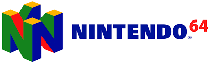

Das Nintendo 64 (kurz N64, auch als der oder die Nintendo 64 bezeichnet), benannt nach seinem 64-Bit-Hauptprozessor, ist die dritte stationäre Videospielkonsole von Nintendo. Es ist der Nachfolger des Super Nintendo Entertainment Systems und nach dem Atari Jaguar die zweite 64-Bit-Spielekonsole. Als Teil der fünften Konsolengeneration konkurrierte es hauptsächlich mit der Sony PlayStation und dem Sega Saturn, konnte jedoch nur letztere Konsole schlagen.

Veröffentlicht wurde es im Juni 1996 zunächst in Japan. In Deutschland kam die Konsole am 1. März 1997 zum Preis von 399 DM auf den Markt, wurde jedoch nach nur acht Wochen auf 299 DM reduziert. Zum Verkaufsstart waren in Deutschland mit Super Mario 64 und Pilotwings 64 zwei Spiele erhältlich, wenige Wochen später folgten weitere Titel.

Nintendo bewarb das Gerät als schnellstes Videospielsystem. Besonders hervorgehoben wurde dabei die 64-Bit-Technologie, die Konkurrenzprodukte Sony PlayStation und Sega Saturn arbeiteten nur mit 32 Bit. Als Speichermedium für die Spiele wurden, wie schon bei den Vorgängerkonsolen, Module verwendet. Diese ermöglichten im Vergleich zu den Konsolen von Sony und Sega, die CD-ROMs verwendeten, zwar sehr kurze Ladezeiten, boten allerdings nur wenig Speicherplatz und waren zudem in der Produktion teuer. Dies schlug sich in den – im Vergleich zu den Mitbewerbern – hohen Verkaufspreisen für die Spiele nieder.
